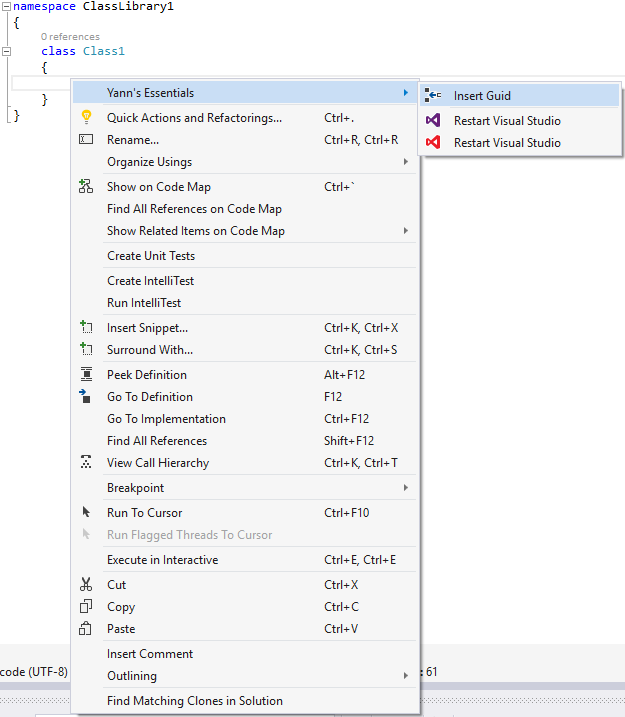
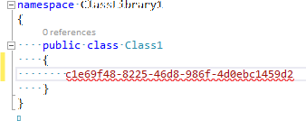
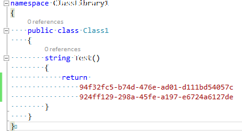

# Luminous Essentials - Insert Guid

Download this extension from the [VS Gallery](https://visualstudiogallery.msdn.microsoft.com/b0cbfde4-9b7a-4a8e-96d9-a689d37b2279)
or get the [CI build](http://vsixgallery.com/extension/b0cbfde4-9b7a-4a8e-96d9-a689d37b2279/).

<!------------------------------------------->

**The easiest and simplest way of inserting a new GUID into your code**.

- *If you like this extension, please come back and add add a *Review* (either with or without text), so people will know what users think of it.*

- *If for some reason you didn't like it, or have any suggestions for improving it, just let me know via the *Q AND A* section.*

See the [changelog](https://github.com/yannduran/insert-guid/blob/master/CHANGELOG.md) for changes and the roadmap for the future.

## Features
- Insert Guid
- Insert Multiple Guids

#### Insert Guid
To insert a guid without this extension, you would have to:

>- move the mouse up to the *Tools* menu
>- click the menu name to get the *Tools* menu to open
>- select *Create Guid* from the *Tools* menu
>- click the *Copy* button
>- click the *Exit* button

To insert a guid using this extension:

>- simply right-click where you want to insert the guid
>- or select some text that you want to replace with a guid and right-click that selected text
>- select *Insert Guid* from the context menu

>

>A new guid has been inserted into your code for you, 
right where you right-clicked.

> 

A guid can be inserted into any code statement, 
or in any attribute declaration, or pretty much anywhere you need a guid.

#### Insert Multiple Guids

To insert multiple guids at a time:

>- use *Alt-Up* or *Alt-Down* to make a muli-selection
>- right-click the selected code (or blank lines)
>- select *Insert Guid* from the context menu

>A new guid for each line of the multiple selection has been inserted into your code for you.

> 

## Contribute
Check out the [contribution guidelines](https://github.com/yannduran/insert-guid/blob/master/CONTRIBUTING.md)
if you want to contribute to this project.

For cloning and building this project yourself, make sure to install the
[Extensibility Tools 2015](https://visualstudiogallery.msdn.microsoft.com/ab39a092-1343-46e2-b0f1-6a3f91155aa6)
extension for Visual Studio which enables some features used by this project.

## License
[Apache 2.0](LICENSE)